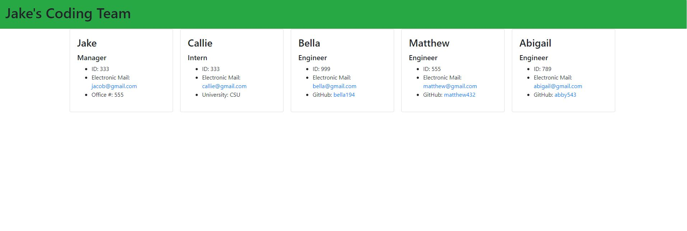

# Team Website Generator

## Description
This node command-line project allows users to create a front end application using object oriented programming. Once the user completely fills out the node questionaire a website is generated displaying teammates names and information.

## TOC
- [Install](#install)
- [Use](#use)
- [License](#license)
- [Contributors](#contributors)
- [Testing](#testing)

## Installation
-Node (NPM I dependencies)

## Use
Allows team leaders to keep all of their coworkers information stored neatly and efficiently.

## License
For learing purposes

## Contributors
Jacob Van Dyke
- [github link](www.github.com/jacobvandyke194)

## Testing
This app is tested using the NPM package 'Jest'. The test files can be found in the /test folder. The

## DEMO

[video link](./assets/teamWebsiteGenerator.webm)

## HTML ScreenShot

